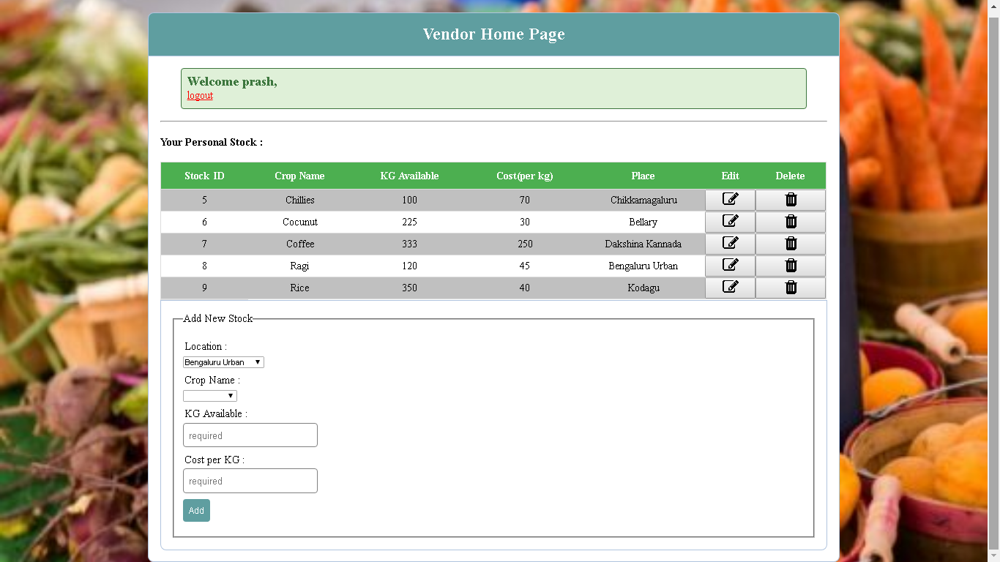
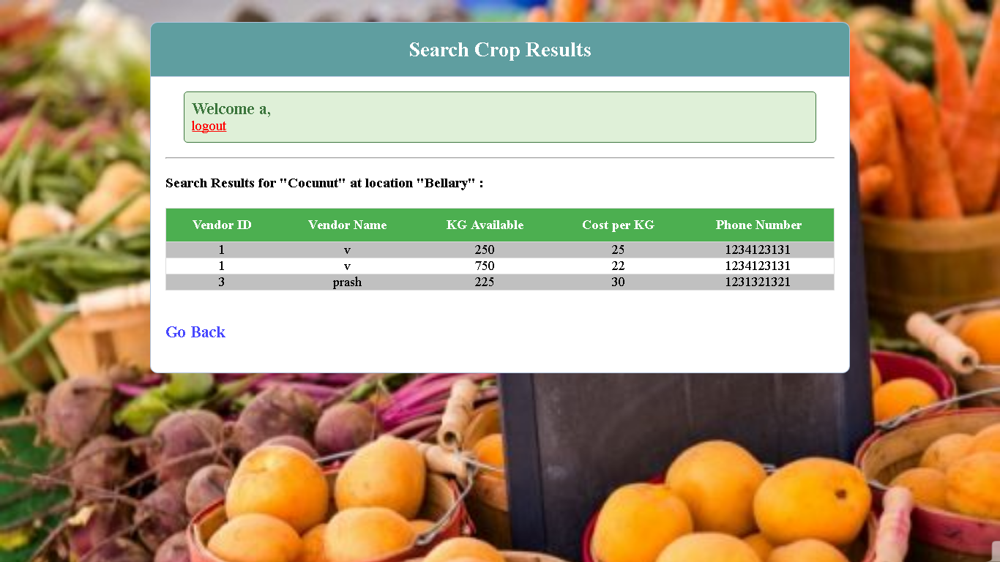

# Farmer-Market-eCommerce-PHP

This PHP project is simple solution for big problem that Farmers and Customers face.
Vendors post the available crop with its details and later alter the details on change.
Customers can view availability of crops with its details.
It eliminates involvement of any middle person and benefits both farmers and customers.

Live Demo : http://www.farmermarket.ml/

## Built using :

	Apache2 : Web Server
	Php : Server-side general-purpose scripting language
	MySQL/MariaDB : Database Server
	Other Basic Front-end Web stuffs : HTML5, CSS3 and JavaScript

## Set up environment for using this repo:

  ### For Linux :
 
	  Install Apache2 ( or any other Web Server) :
  	  $ `sudo apt-get install apache2`
		
	  Install MySQL/MariaDB :
		  $ `pip install mysql-server libapache2-mod-auth-mysql php5-mysql`
		
	  Install PHP :
		  $ `sudo apt-get install sudo apt-get install php5 libapache2-mod-php5 php5-mcrypt`
			
	  Restart apache so that all of the changes take effect:
  		$ `sudo service apache2 restart`
    
    Copy the complete folder to the location `/var/www/html` within a folder called glasseffect (per say)
    
  ### For Windows :
  
     Download single package software Xampp from this link : https://www.apachefriends.org/download.html
     
     Copy the complete folder to the location `C:\xampp\htdocs\glasseffect`

## Database Structure :

## Run :

	Run Apache2
	
	Run MySQL / MariaDB
	
	Browse with any Browser to the following link and DONE !
		`http://localhost/glasseffect`

### Screenshot :

  
  Screenshot of Vendor
  

  Screenshot of Customer

Made with ❤️ from Karnali, Nepal
